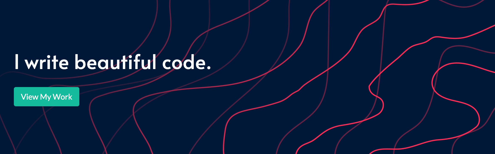

# Hi there, my name is [Josh Allan][website] .

---

## I'm a full-stack husband, father, student, and developer.

-  &nbsp; &nbsp; University of Richmond Coding Bootcamp (Full-stack, MERN) alum
- 👔 &nbsp; &nbsp; 2x entreprenuer and business owner, currently employed at Paymerang
- 🥅 &nbsp; &nbsp; 2022 Goal: Mentor a new hire dev at Paymerang
- 👯 &nbsp; &nbsp; Looking to collaborate with other code-hungry developers
- 🎥 &nbsp; &nbsp; Lover of all things Star Wars (movies, books, tv, games, etc.)
- 🍗 &nbsp; &nbsp; Fun fact: I run the @rvagrubs instagram account

---

## Technology

#### Stack

 &nbsp;
 &nbsp;
 &nbsp;
 &nbsp;

#### Languages

 &nbsp;
 &nbsp;
 &nbsp;

#### Libraries & Frameworks

 &nbsp;
 &nbsp;
 &nbsp;
 &nbsp;
 &nbsp;
 &nbsp;
 &nbsp;

#### Data

 &nbsp;
 &nbsp;
 &nbsp;
 &nbsp;
 &nbsp;

#### Version Control

 &nbsp;
 &nbsp;

#### Platforms

 &nbsp;
 &nbsp;
 &nbsp;
 &nbsp;

#### General

 &nbsp;
 &nbsp;
 &nbsp;
 &nbsp;
 &nbsp;
 &nbsp;

---

## Summary

Innovative Frontend Developer with expertise in both web design and digital marketing. Offering 10+ years of professional marketing experience, with a fresh Full-Stack Web Development certification (MERN stack) added to my belt. Quick to learn and master new technologies, and able to work in both team- and self-directed environments.

#### View My Resume

---

## GitHub Stats

---

### Currently on rotation:

---

## Let's connect!

 

 

[website]: https://joshallan.dev/
[linkedin]: https://www.linkedin.com/in/joshuamallan/
[email]: mailto:allan.josh07@gmail.com
